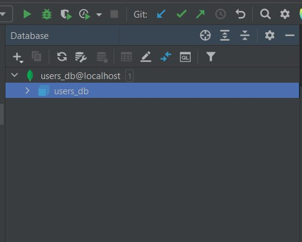
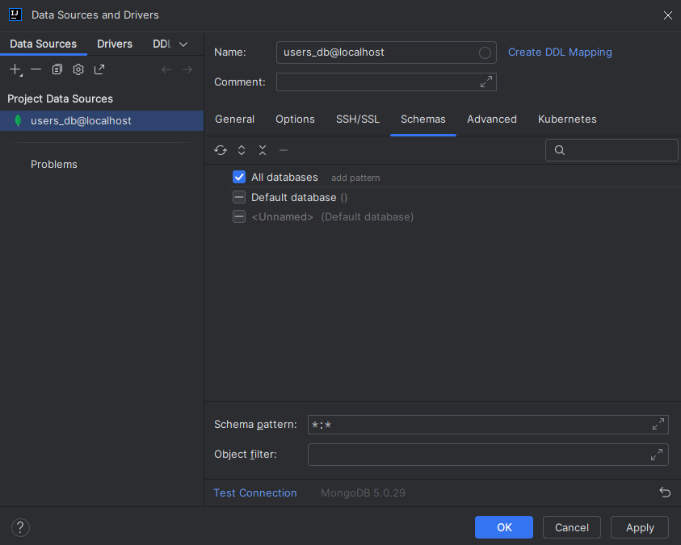
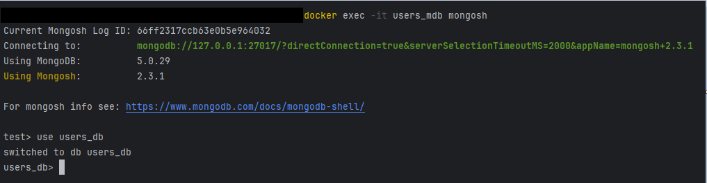
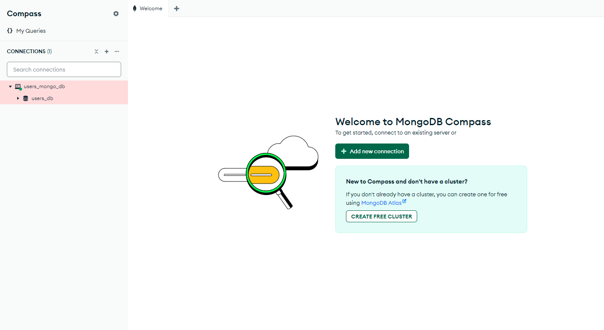

# Features of working with the project database

## Starting the database is standard

1. Docker is used to start the database. First from the root of the folder
   *"docker-compose up"* command is executed via the command line.
   After executing this command, the docker container is lifted.
2. Then in the **Database** tab a **New datasource** is created in the 
IntelliJ Idea with the using *MongoDB*.
3. After creating a new datasource in the parameters are specified:
   - the ***General*** tab specifies the port, user, password, database name 
taking into the parameters specified in the *yaml* file
   - in the ***Schemas*** tab select the **All databases** parameter
   - in the ***Advanced*** tab, the **authMechanism** parameter is set to *SCRAM-SHA-1*
4. After that the connection to the container is made, and database is created
internal automatically
   

## What can go wrong?

In the IntelliJ Idea of version *2022.2.4* everything works like this, 
without any problems.

But in a newer version, *2024.1.4*, I ran into this problem, that when 
connecting to the container, the database is not displayed in the list.
Instead of the *users_db*, is not defined and is listed as **Unnamed**.

## Problem solving

In order to solve this problem, first I tried to find the corresponding 
problems on the IntelliJ Idea website, but nowhere was this error described.
So I tried to connect to my database through the console using the command 
*"docker exec -it mongoContainer mongosh"* and *"use users_db"*. When I
was able to access this container and connect to the previously created 
database, I realized that the problem isn't what I'm doing, but in the UI 
IntelliJ Idea. So I decided to use additional software. My choice was 
**MongoDB Compass**.

## Working with MongoDB Compass

With this GUI, I was finally able to connect to my database and visually 
start working with it.

For this I just entered the connection data from my *yaml* file:

- ***host*** - entered my local port
- in the **Authentication** column entered user data, password, database name, 
and *SCRAM-SHA-1* encryption.

That was enough and when I clicked the connect button, I had access to my local 
database ready to go access to my local database, ready for work.

## Helpful links

- https://www.mongodb.com/community/forums/t/syntax-error-missing-semicolon/203269/3
- https://www.mongodb.com/products/tools/compass